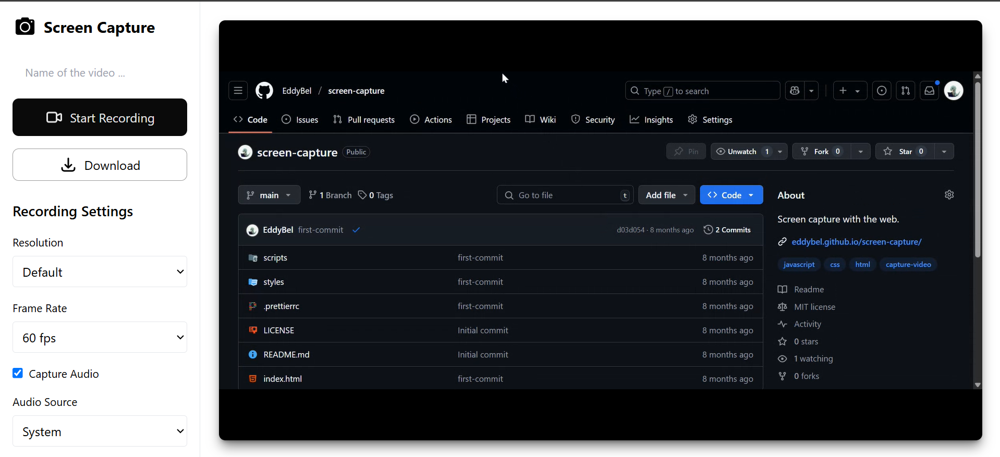

<h1 align="center">Web Video Capturer</h1>

<p align="center">Capturador de video desde el navegador</p>

<p align="center">
  
  
  
  
  
</p>



**Web Video Capturer** es una herramienta que permite capturar video desde la pantalla y audio del sistema o micrófono,
directamente en el navegador. El objetivo es ofrecer una forma sencilla de grabar lo que ocurre en tu pantalla, ya sea
con o sin audio, y guardarlo como un archivo de video.

## Características actuales

- **Captura de pantalla:** Permite grabar lo que sucede en tu pantalla en tiempo real.
- **Captura de audio:** Graba audio del sistema o del micrófono, según la configuración.
- **Interfaz amigable:** La página incluye controles de UI para iniciar la captura, ajustar la configuración de audio, y
  más.
- **Vista previa:** Muestra una vista previa del video grabado antes de su descarga.
- **Descarga fácil:** Permite descargar el video grabado en formato `.webm`.

## Tecnologías utilizadas

- **HTML5:** Para la estructura de la página y controles de UI.
- **CSS3:** Para un diseño responsivo y moderno.
- **JavaScript (ES6+):** Para las funcionalidades interactivas, como la captura de pantalla, grabación de audio y la
  gestión de flujos multimedia.
- **API de MediaDevices:** Utiliza las APIs `getDisplayMedia` y `getUserMedia` para obtener los flujos de video y audio.

## Instalación

### Clonar el repositorio

1. Clona el repositorio para obtener una copia local del proyecto:

   ```bash
   git clone https://github.com/EddyBel/screen-capture.git
   ```

2. Accede a la carpeta del proyecto:

   ```bash
   cd screen-capture
   ```

3. Abre el archivo `index.html` en tu navegador para comenzar a usar la aplicación.

   ```bash
   open index.html
   ```

## Cómo usarlo

1. Haz clic en el botón **Iniciar Captura** para comenzar la grabación de la pantalla.
2. Elige si deseas capturar el audio del sistema o del micrófono.
3. Ajusta la configuración de la captura (fps, resolución, etc.) desde los controles de la UI.
4. Una vez finalizada la grabación, podrás ver una vista previa del video y descargarlo como archivo `.webm`.

## Contribuciones

Si deseas mejorar este proyecto, puedes hacerlo siguiendo estos pasos:

1. Haz un **fork** de este repositorio.
2. Crea una nueva rama para tus cambios (`git checkout -b nueva-funcionalidad`).
3. Realiza los cambios que desees y haz un **commit** (`git commit -am 'Añadir nueva funcionalidad'`).
4. Haz **push** a tu rama (`git push origin nueva-funcionalidad`).
5. Abre un **pull request** para que pueda revisarlo.

## Licencia

Este proyecto está bajo la Licencia MIT. Puedes consultar más detalles en el archivo [LICENSE](LICENSE).

Si tienes alguna sugerencia o simplemente deseas compartir tus comentarios, ¡no dudes en decírmelo! Estoy constantemente
buscando formas de mejorar esta herramienta.

---

<p align="center">
  <a href="https://github.com/EddyBel" target="_blank">
    
  </a>
  <a href="https://www.linkedin.com/in/eduardo-rangel-eddybel/" target="_blank">
    
  </a>
</p>
